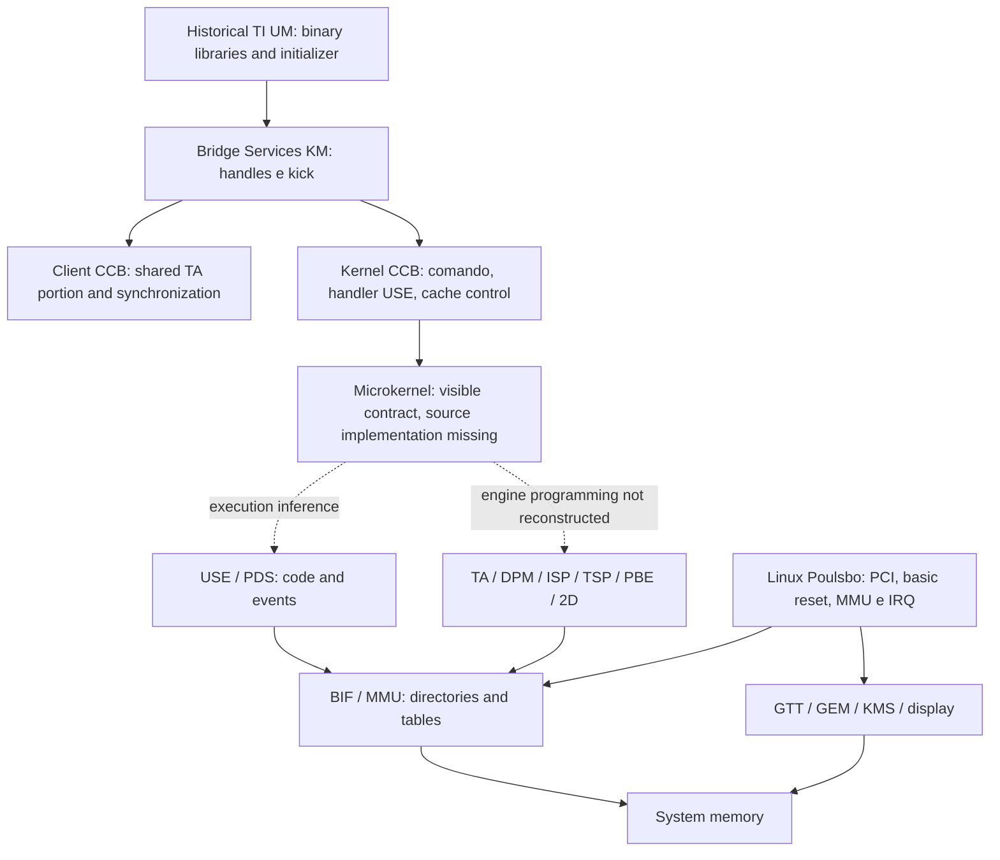

# SGX535-GFX — rebuilt architecture

> Phase 2 update: local history contains `sgx535defs.h` and an explicit Poulsbo integration in DDK 1.14. The absence references below describe the Phase 1 master checkout. See [archaeology](source-archaeology.md), [recovered files](sgx535-missing-files.md), and [Poulsbo comparison](poulsbo-evidence.md) for the expanded state.

## Scope and method

Static investigation on 2026-09-16. No new driver, MMIO access, module loading, firmware, or GPU command was implemented or executed. 'Current Linux' in this context means **the local checkout identified below**, not a statement about the remote HEAD or the target machine's kernel.

- **CONFIRMED**: statement or behavior found in the indicated code/artifact; does not mean validation in silicon.
- **INFERRED**: conclusion derived from cited evidence, with explicit premises.
- **UNKNOWN**: information not established by these sources. The absence of code here does not prove the absence of hardware capability.

The requested sources, `ti-sgx-km` and `ti-sgx-um`, `ti-sgx-km` and `ti-sgx-um` are present with the names `omap5-sgx-ddk-linux` and `omap5-sgx-ddk-um-linux`. They were not renamed. Commits and evidence inventory are in [evidence.txt](evidence.txt). The three trees were unmodified at the beginning of the analysis.

| Tree | Examined commit |
| --- | --- |
| Linux | `9b87fdc9af2fbfcdb5c24a64139685ef80f6573f` |
| TI KM | `430673f78b79eccdf308a6bbfb524209b485d2cc` |
| TI UM | `b6801bf89e00d69893c2957455bbeb3195c0ed52` |

## Main result

**CONFIRMED:** there is an explicit SGX535 selection, with a declared 32-bit virtual space, multiple contexts, 16 BIF directory lists, 2D hardware, two USE pipes, and autoclockgating. It is a DDK configuration, not a Poulsbo measurement. [references/omap5-sgx-ddk-linux/eurasia_km/services4/srvkm/hwdefs/sgxfeaturedefs.h:63-73](../references/omap5-sgx-ddk-linux/eurasia_km/services4/srvkm/hwdefs/sgxfeaturedefs.h#L63).

**CONFIRMED:** the dispatcher includes `sgx535defs.h`, but this file is not listed in the checkout inventory. The specific headers present are SGX530, SGX540, and SGX544; the Makefiles OMAP4430/5430 select 540 rev.120 and 544 rev.116, respectively. Therefore, we do not have a complete SGX535 DDK nor evidence of an OMAP-SGX535 integration in this package. [references/omap5-sgx-ddk-linux/eurasia_km/services4/srvkm/hwdefs/sgxdefs.h:48-80](../references/omap5-sgx-ddk-linux/eurasia_km/services4/srvkm/hwdefs/sgxdefs.h#L48); [references/omap5-sgx-ddk-linux/eurasia_km/eurasiacon/build/linux2/omap4430_linux/Makefile:109-110](../references/omap5-sgx-ddk-linux/eurasia_km/eurasiacon/build/linux2/omap4430_linux/Makefile#L109); [references/omap5-sgx-ddk-linux/eurasia_km/eurasiacon/build/linux2/omap5430_linux/Makefile:112-113](../references/omap5-sgx-ddk-linux/eurasia_km/eurasiacon/build/linux2/omap5430_linux/Makefile#L112); [inventory](evidence.txt).

**CONFIRMED:** Linux associates Poulsbo/GMA500 with SGX535 and Intel PCI IDs `8086:8108`/`8086:8109`; its own ioctl interface is empty and the registered features are MODESET and GEM. [references/linux/drivers/gpu/drm/gma500/psb_drv.c:43-59](../references/linux/drivers/gpu/drm/gma500/psb_drv.c#L43); [references/linux/drivers/gpu/drm/gma500/psb_drv.c:91-95](../references/linux/drivers/gpu/drm/gma500/psb_drv.c#L91); [references/linux/drivers/gpu/drm/gma500/psb_drv.c:505-510](../references/linux/drivers/gpu/drm/gma500/psb_drv.c#L505).

## Map with borders of evidence

The arrows of the host protocol are **CONFIRMED in the DDK**: bridge calls `SGXDoKickKM`, this fills the shared part and schedules the CCB; the command contains handler address USE. [references/omap5-sgx-ddk-linux/eurasia_km/services4/srvkm/bridged/sgx/bridged_sgx_bridge.c:188-605](../references/omap5-sgx-ddk-linux/eurasia_km/services4/srvkm/bridged/sgx/bridged_sgx_bridge.c#L188); [references/omap5-sgx-ddk-linux/eurasia_km/services4/srvkm/devices/sgx/sgxkick.c:72-96](../references/omap5-sgx-ddk-linux/eurasia_km/services4/srvkm/devices/sgx/sgxkick.c#L72); [references/omap5-sgx-ddk-linux/eurasia_km/services4/srvkm/devices/sgx/sgxkick.c:732-803](../references/omap5-sgx-ddk-linux/eurasia_km/services4/srvkm/devices/sgx/sgxkick.c#L732); [references/omap5-sgx-ddk-linux/eurasia_km/services4/include/sgx_mkif_km.h:70-96](../references/omap5-sgx-ddk-linux/eurasia_km/services4/include/sgx_mkif_km.h#L70).

The execution of the microkernel in USE is **INFERRED** from the handler description and the USSE_EDM names; its host protocol is confirmed, but the internal flow and the ISA are not reconstructed. The requestors TA/VDM/2D/PBE/TSP/ISP/USSEPDS/host are **CONFIRMED as Linux diagnostic names and bits**, without establishing the physical order of the pipeline. [references/omap5-sgx-ddk-linux/eurasia_km/services4/include/sgx_mkif_km.h:72-74](../references/omap5-sgx-ddk-linux/eurasia_km/services4/include/sgx_mkif_km.h#L72); [references/omap5-sgx-ddk-linux/eurasia_km/services4/include/sgx_mkif_km.h:289-306](../references/omap5-sgx-ddk-linux/eurasia_km/services4/include/sgx_mkif_km.h#L289); [references/linux/drivers/gpu/drm/gma500/psb_irq.c:159-188](../references/linux/drivers/gpu/drm/gma500/psb_irq.c#L159).

The separation GTT/MMU is **CONFIRMED** by two distinct insertions in the GEM pin. GTT and BIF should not be drawn as a single table nor should it be assumed that every transaction passes through both in series. [references/linux/drivers/gpu/drm/gma500/gem.c:29-59](../references/linux/drivers/gpu/drm/gma500/gem.c#L29).

## Reconstructed sequence of the DDK

**CONFIRMED, code shared conditioned by features:** clocks → init script part 1 → reset → script part 2 → clear status → kick → wait for `INIT_COMPLETE`. Scripts and handler addresses arrive via the initialization structure; the concrete lists SGX535 are not in this source. [references/omap5-sgx-ddk-linux/eurasia_km/services4/srvkm/devices/sgx/sgxinit.c:207-293](../references/omap5-sgx-ddk-linux/eurasia_km/services4/srvkm/devices/sgx/sgxinit.c#L207); [references/omap5-sgx-ddk-linux/eurasia_km/services4/srvkm/devices/sgx/sgxinit.c:467-665](../references/omap5-sgx-ddk-linux/eurasia_km/services4/srvkm/devices/sgx/sgxinit.c#L467).

**CONFIRMED:** recovery triggers restart with hardware recovery; the non-MP reset branch uses a temporary PD and handles pending faults before restoring BIF context. This is more than simply toggling SOFT_RESET. [references/omap5-sgx-ddk-linux/eurasia_km/services4/srvkm/devices/sgx/sgxinit.c:1582-1645](../references/omap5-sgx-ddk-linux/eurasia_km/services4/srvkm/devices/sgx/sgxinit.c#L1582); [references/omap5-sgx-ddk-linux/eurasia_km/services4/srvkm/devices/sgx/sgxreset.c:544-655](../references/omap5-sgx-ddk-linux/eurasia_km/services4/srvkm/devices/sgx/sgxreset.c#L544). **UNKNOWN:** which of these operations are necessary and correct for each Poulsbo stepping.

## Licenses and limits

This result contains documentation, numbers, and references, without copied implementation. The KM README declares MIT/GPLv2 and the consulted headers carry a dual notice; the consulted Linux code uses SPDX GPL-2.0-only. This must be checked by file before any future reuse. [references/omap5-sgx-ddk-linux/eurasia_km/README:17-25](../references/omap5-sgx-ddk-linux/eurasia_km/README#L17); [references/omap5-sgx-ddk-linux/eurasia_km/services4/srvkm/hwdefs/sgxmmu.h:1-40](../references/omap5-sgx-ddk-linux/eurasia_km/services4/srvkm/hwdefs/sgxmmu.h#L1); [references/linux/drivers/gpu/drm/gma500/mmu.c:1](../references/linux/drivers/gpu/drm/gma500/mmu.c#L1).

The UM manifesto identifies `targetfs` as binary under TI TSPA and imposes restrictions on modification and reverse engineering. The partial textual extraction and its location are in [evidence record](evidence.txt); it does not replace a full review of the original document. No binary payload was extracted for implementation, decompiled, disassembled, or executed. The observation of ELF symbols was limited to artifact inventory. Do not apply the KM license to the UM.

## Leitura do conjunto

- [Registradores](registers.md): Linux offsets and interpretation limits.
- [MMU/BIF](mmu-bif.md): translation, caches, and divergences.
- [Command submission](command-submission.md): CCB, sync, and IRQ.
- [USSE](usse.md) and [firmware](firmware.md): known contract and absent parties.
- [TI versus Poulsbo](ti-vs-poulsbo.md): classes A/B/C.
- [Estado do gma500](gma500-current-state.md): capacidades e lacunas.
- [20 unknowns and minimum experiment](unknowns.md): blockages and next steps.
