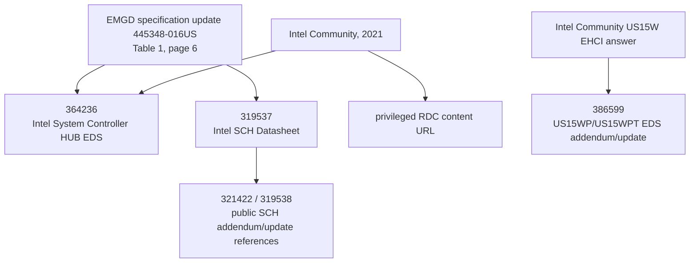

# Intel document 364236 citation graph

This graph records public references, not the contents of restricted documents.

| node/reference | date and exact public wording | source quality | subject that caused the citation | result of recursive follow-up |
|---|---|---|---|---|
| `445348-016US` | April 2012; Table 1 calls `364236` *Intel System Controller HUB External Design Specification* | PRIMARY-DIRECT | EMGD related-document list | establishes number/title only (P5-001) |
| Intel Community US15WPT thread | 2021; Intel moderator calls it *Intel System Controller Hub (Intel SCH) External Design Specification* and gives RDC URL | PRIMARY-DIRECT for the public statement | request for SCH documentation | privileged access stated; anonymous endpoint remains 404 (P5-002/P5-005) |
| `319537-003US` | May 2010; public SCH Datasheet | PRIMARY-DIRECT for document identity | SCH component, PCI functions, memory map, registers | no retrieved evidence that it republishes the SGX access contract |
| `321422` / `319538` | listed by public Z5xx/SCH update/addendum references | PRIMARY-DIRECT for bibliographic relationship | SCH US15WP/US15WPT datasheet/update | no retrieved SGX identification-read section |
| `386599` | Intel support describes *Intel SCH EDS Addendum and Specification Update Addendum for US15WP and US15WPT* | PRIMARY-DIRECT for public statement | EHCI USB handshaking question | different subject; no SGX contents inferred |

## Termination

The public graph establishes a related-document family and proves that additional SCH EDS material was controlled through RDC. It does not reproduce a `364236` section, table, register attribute, SGX power sequence, PCI-to-SGX revision mapping, or read-failure behavior. Every path therefore terminates as one of: metadata only, restricted content, a publicly available but non-SGX SCH datasheet, or an unrelated-subject addendum.

No citation is treated as evidence that `364236` contains the missing contract.
