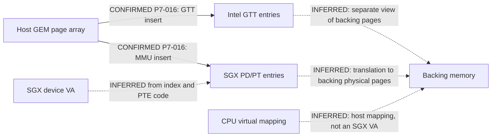

# 7.4 — BIF, MMU and address-space contract

## Register names and directory selectors

The following are SGX-relative offsets from historical definitions, not an access whitelist. P7-014 covers [SGX535 H535](../archaeology-data/H535.txt):375–378,417–446,539–696; [EMGD SGX535](../poulsbo-data/EMGD_drm_pvr_services4_srvkm_hwdefs_sgx535defs_h.txt):466–541,580–582; and [Linux 5.10.240 psb_reg.h](../phase4-2-data/antix-source/drivers/gpu/drm/gma500/psb_reg.h):116–154.

| name | offset | reconstruction |
|---|---|---|
| BIF_CTRL | `0xc00` | control fields include flush, invalidate, fault clear and requester bypass; no read/write safety inferred |
| DIR_LIST_BASE1 | `0xc38` | header name |
| DIR_LIST_BASE2 | `0xc3c` | SGX535 header name |
| DIR_LIST_BASE15 | `0xc70` | SGX535 header name |
| DIR_LIST_BASE0 | `0xc84` | separate slot, not preceding BASE1 |
| PDS_EXEC_BASE | `0xab8` | address-field definition; Linux writes `0x20000000` |
| BIF_3D_REQ_BASE | `0xcac` | address-field definition; Linux writes `0x30000000` |

Those last two programmed values are code constants, not recovered PDS/3D programs or measured device VAs.

P7-004/P7-009/P7-015 preserve three computations:

| implementation | expression for nonzero argument | argument 1 result |
|---|---|---|
| Linux 5.10.240 `psb_mmu_set_pd_context` | `BASE1 + hw_context * 4` | `0xc3c` |
| historical PSB `psb_mmu_set_pd_context` | same expression | `0xc3c` |
| DDK/EMGD list initialization | `BASE1 + 4 * (ui32DirList - 1)` | `0xc38` |

The target load path assigns the default PD to context 0 and its fault PD to argument 1 (P7-001, `psb_drv.c:338–339`). The DDK source names an EDM kernel context and uses the list-minus-one formula (P7-009). That naming does not prove that Linux deliberately reserves list 1.

There is an additional **CONFIRMED software-expression mismatch**: Linux teardown computes `BASE0 + pd->hw_context * 4` (P7-004, `mmu.c:237–248`). For stored context 1, that expression yields `0xc88`, while setup selected `0xc3c`. The SGX535 header calls `0xc88` `TWOD_REQ_BASE` (P7-014, `H535:635–638`); this makes the mismatch more concrete but does not establish what the teardown write does on the target. The old PSB source contains the same pattern (P7-015).

| proposed explanation | status | evidence needed |
|---|---|---|
| different numbering convention | UNKNOWN | an explicit conversion between the API argument and physical directory slot |
| reserved context | UNKNOWN | documented requester/EDM/fault context allocation |
| deliberate implementation difference | UNKNOWN | rationale and applicable hardware behavior |
| revision difference | UNKNOWN | register-layout/errata coverage tied to each build and physical revision |
| Linux bug or documentation mismatch | UNKNOWN | authoritative contract and source-history explanation |

No expression was corrected or tested.

## Address namespaces and parallel mappings

P7-016: the target [gtt.c](../phase4-2-data/antix-source/drivers/gpu/drm/gma500/gtt.c):235–260 explicitly inserts the same GEM page array into both GTT and SGX MMU. It derives the MMU VA from `gatt_start + gt->offset`. [mmu.c](../phase4-2-data/antix-source/drivers/gpu/drm/gma500/mmu.c):41–49,151–162,696–755 indexes directory/table entries and constructs PTEs from page PFNs. This supports parallel software mappings of memory; it does not establish serial hardware translation through both tables.

**Rejected as unsupported:** `SGX BIF → GTT → RAM`. Neither shared PFNs nor numerically equal CPU-aperture/GPU addresses proves that chain. Exact interconnect routing, bus-versus-host-physical equivalence, cache coherence, and requester behavior remain UNKNOWN.

| source name | meaning in this source | target state |
|---|---|---|
| `sgx_reg` | CPU virtual MMIO mapping | owner known in source; no active access |
| `gatt_start` | BAR2 resource start (with a different-platform fallback) | TVZ BAR2 reported; driver value not sampled |
| `gtt_start` | BAR3 resource start | not interchangeable with `gtt_phys_start` |
| `gtt_phys_start` | PGETBL_CTL value masked by PAGE_MASK | hardware register value not collected |
| `mmu_gatt_start` | software constant `0xe0000000` | not a measured physical region |
| `stolen_base` | value from PCI BSM | not supplied by TVZ; cannot infer it from BAR size |
| stolen size | `gtt_phys_start - stolen_base - PAGE_SIZE` | source formula only; no measurement |
| SGX PD/PT backing | allocated pages; PTEs encode shifted PFNs and flags | exact safe bus, cache and lifetime contract incomplete |

P7-016, `gtt.c:426–546`: the comment about avoiding `0xd0000000` says **video MMU**. It is not an SGX535 identification-read erratum. The CDV fallback comments are not Poulsbo evidence.

P7-017 preserves another divergence: load maps stolen PFNs at `gatt_start` (`psb_drv.c:330–336`); unload removes them from `mmu_gatt_start` (170–175). It remains UNKNOWN why those domains differ.

## Gate

ADDRESS-SPACE-CONTRACT: **INCOMPLETE**

MMU-WRITE-AUTHORIZATION: **NO**

BIF-WRITE-AUTHORIZATION: **NO**

Missing: context/register numbering contract, setup/teardown rationale, requester selection and BRNs, correct address domains, bus/coherence constraints, safe invalidation and fault behavior, isolation and state recovery. The diagram is sufficient to frame source questions, not to initialize MMU/GTT/BIF or design a page-table experiment.
