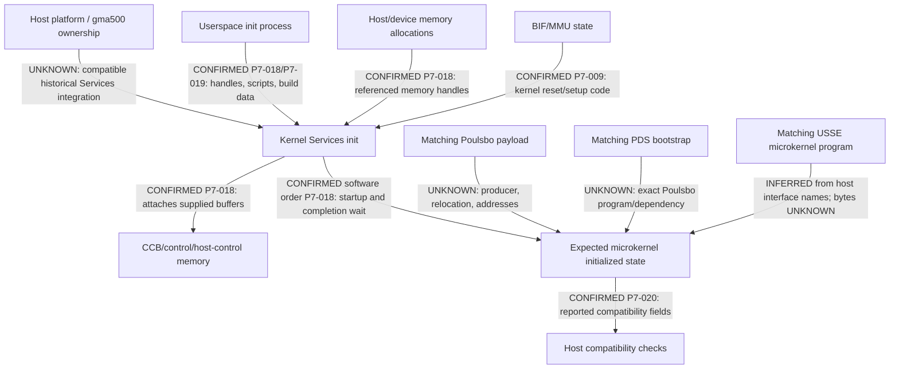

# 7.5 — Firmware and microkernel contract

No artifact was loaded, executed, disassembled, or submitted to SGX. This review describes existing source and binary metadata. It does not reconstruct a command-submission mechanism (7.6).

## Artifact boundaries

| artifact | classification | established fact and limit |
|---|---|---|
| historical PSB XHW interface | POULSBO-SPECIFIC | shared X-server communication buffer; not proof that XHW itself is GPU firmware |
| DDK `system/poulsbo` and Poulsbo build | POULSBO-SPECIFIC | named platform integration and default 535/121 build configuration |
| DDK Services4 init/bridge/common microkernel headers | UNKNOWN as a standalone platform artifact | multi-core source included in the Poulsbo-capable tree; must be qualified by build macros |
| `sgx535defs.h` and SGX535-selected feature/errata branches | SGX535-GENERIC | register/feature/build definitions; no payload or integration contract |
| EMGD `system/plb` / PLB integration | POULSBO-SPECIFIC | source in a community mirror; not an authenticated vendor binary release |
| EMGD common Services start/interface code | UNKNOWN as a standalone platform artifact | requires PLB selection and a matching UM; a common file does not prove a particular delivered configuration |
| OMAP5 `libsrv_init.so.1.9.6.0` and embedded-object symbols | OTHER-SGX | ARM ELF in OMAP5/DRA7xx package; not verified SGX535/Poulsbo code |
| MSVDX firmware material | UNKNOWN for SGX relevance; excluded | video-firmware evidence does not identify an SGX microkernel |
| matching Poulsbo UM initialization scripts and program payload | UNKNOWN / not recovered | no hash or compatibility claim can be assigned to missing content |

Provenance and actual artifact hashes are in [source provenance](source-provenance.md) and [source-index.json](source-index.json). Classification describes source scope, not whether a binary is executable on the Dell.

## Kernel/userspace split

CONFIRMED source behavior, P7-018: [INFO](../poulsbo-data/INFO.txt):83–153 defines kernel CCB/control/event-kicker/host-control/TA3D memory handles, host-kick addresses, scripts, build options, structure sizes, and clock-related data. [SBRIDGE](../poulsbo-data/SBRIDGE.txt):315–351 declares init-query and init-part-2 bridge structures. [INIT](../poulsbo-data/INIT.txt):207–298 copies supplied scripts and handles into kernel state.

P7-019 extends that trace into the original Git object `cb46ba4d…:eurasia_km/services4/srvkm/bridged/sgx/bridged_sgx_bridge.c:980–1058,1614–1619`: the wrapper requires an init process, resolves memory handles and passes the received structure to `DevInitSGXPart2KM`. This supports userspace-provided initialization inputs with kernel execution/control. It does not recover the userspace producer or prove a valid payload for Poulsbo.

P7-018, `INIT:327–378,534–570,633–734`: kernel script execution supports register operations; initialization orders clock setup, script part 1, reset, script part 2, a host-control init-status reset and a kick, then waits for microkernel initialization completion. This is historical order only. The failure path has debug handling; it does not bound CPU MMIO completion or authorize the same sequence now.

P7-020, `INIT:2670–2860`: compatibility logic checks client/KM options and microkernel-reported information, including core revisions and structure sizes, with explicit exceptions. Since it queries an initialized microkernel, it cannot be repurposed as a passive pre-firmware identity check.

P7-022: [PSB XHW](../poulsbo-data/PSB_psb_xhw_c.txt):416–470 maps an X-server communications buffer supplied by handle. [EMGD header](../poulsbo-data/EMGD_drm_include_emgd_drm_h.txt):638–647 identifies an X-server flag and a return value from `PVRSRVDrmLoad`. These are separate historical interfaces; neither establishes payload equivalence to the DDK.

## Embedded-program evidence

P7-021 rechecks the existing OMAP artifact at UM commit `b6801bf89e00d69893c2957455bbeb3195c0ed52`. SHA-256:

`a1a3572ee4ae6104505808d171d6b4cd023309959588f890b2192aea44fafdda`

Its ELF symbol table contains `pbuKernelProgram`, `pbSlaveuKernelProgram`, and `g_pui32PDSUKERNEL_*` objects. These are CONFIRMED object names/metadata only. ELF symbol values are not automatically file offsets, GPU VAs, relocation addresses or executable entry points. OMAP initialization using embedded program data is an INFERRED interpretation of names and package context; the corresponding Poulsbo payload/loader remains UNKNOWN.

Thus:
- **Userspace-provided initialization plus kernel-controlled initialization:** CONFIRMED for the inspected Services interface.
- **Exact Poulsbo host-loaded program bytes, destination, relocation and validation:** UNKNOWN.
- **A standalone firmware-file loader versus programs embedded in Poulsbo userspace:** UNKNOWN.
- **Kernel-only complete firmware initialization:** not established by the recovered kernel half.
- **OMAP544 microkernel usable on Poulsbo:** not established and not permitted.

## Minimum dependency graph

Arrows label source dependencies or explicit gaps, not executable instructions.

The graph stops at initialization. Required CCB-related allocations are recorded only as init dependencies; no queue algorithm, submission experiment, shader or instruction stream is designed here.

## Provenance and gate

The TI UM package and EMGD binary license notices restrict reuse; public availability does not make the payload open-source. No binary is imported into new implementation code. Source licenses remain per file, and Linux/PSB GPL-only implementation is not copied into permissive Mesa code. The preserved [EMGD license notice](../poulsbo-data/EMGD_readme_txt.txt):1–15 and [existing source policy](../poulsbo-historical-abi.md) remain applicable to provenance review.

FIRMWARE-CONTRACT: **INCOMPLETE**

MICROKERNEL-CONTRACT: **INCOMPLETE**

FIRMWARE-EXECUTION-AUTHORIZATION: **NO**

COMMAND-SUBMISSION-AUTHORIZATION: **NO**

Missing: matching Poulsbo UM/init producer, legally usable payload/source and build options, physical revision/BRN match, script contents, program layout/relocations/addresses, safe memory/cache/MMU/power dependencies, authenticated compatibility and recovery contract. Phase 7.6 may neither be designed nor executed on this evidence.
