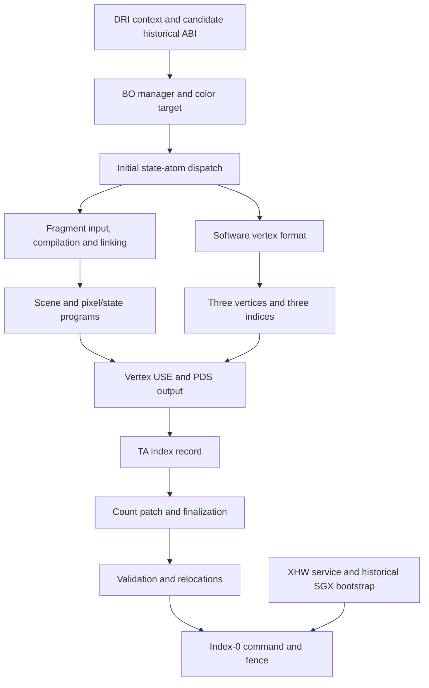

# Frozen draw closure (P7G)

**RESULT B — MINIMAL CLEAN-ROOM 3D USERSPACE PATH NOT YET SPECIFIABLE.** This pass follows one indexed triangle. It closes the historical frontend edge, corrects two earlier layout interpretations, and derives a conditional vertex USE/TA output. It does not close the fragment program, complete scene programs, or first-submit bootstrap contract. No implementation-grade specification or Phase 8 plan is created.

All unqualified addresses below are ELF VAs in retained `psb_dri.so`, SHA-256 `74ca42991906741ee91be1bc088ae0b142fa71b6a85658c5dad0851ce50dd0d8`. Ghidra adds `0x10000`; raw addresses in decompiler function names must be translated back. Context offsets written `C+...` use the existing context-derived convention: raw context displacement is `0x1345c + offset`. Scene, BO, program and TNL offsets are relative to their own objects. The [evidence matrix](../../evidence-matrix.csv) records P7G sources separately from earlier P7B–P7F entries.

## Frozen inputs and limits

The candidate is one triangle with indices `0,1,2`, a new context and one scene, a 32×32 RGBA color target, software-prepared position and primary color, smooth shading, full color write mask and white at every vertex. Texture, fog, lighting, blending, logic operations, dithering, alpha/depth/stencil tests, culling, user clip planes, polygon offset, queries, scissor, multisampling and hardware vertex transformation are excluded. No prior GL draw or clear is part of the selected path. The intended post-viewport positions are `(8,8,0.5,1)`, `(24,8,0.5,1)`, `(8,24,0.5,1)`. These are **specified research inputs**, not observations or a claim that all private fields needed to realize them have been recovered.

The software branch is real: context creation `0x00048592` recognizes `INTEL_NO_HWTNL` and sets ELF global `0x002bb280` to zero. `0x00029dd9` then selects `0x00040355`, rather than the compiled hardware-vertex path `0x0004252d`. This describes a historical selection condition; no environment setting or binary was executed. The primitive table at `0x00258040` maps input `4` to code `0`; `0x00026aa1` updates renderer `+0x3c`, context `+0x770/+0x774` and dirty flags. Validator `0x0003b430` accepts code `0`, count `3`; `0x00027fa0` uses the ordinary index copier rather than fan/strip expansion (P7G-003).

A point was not substituted: it has different raster state. The constant program builder `0x00039ac4` was also checked. Its callers are scene/clear setup `0x00027060` and `0x0002a794`, not the normal fragment selection callback. Reusing it as the triangle's fragment program would require an unproven interface substitution. Disabling textures does **not** bypass fragment compilation.

## Dependency status

| node | classification for this draw | reason |
|---|---|---|
| A | INFERRED | DRI layout and historical callbacks confirmed individually; exact built stack remains a release-family correlation |
| B | BLOCKING-UNKNOWN | Pool algorithms and several flags known; complete selected surface/program object inventory not closed |
| C | CONFIRMED as dispatch mechanism; BLOCKING-UNKNOWN as complete state | All 17 descriptors and their order recovered; required output bytes still depend on fragment result and scene state |
| D | BLOCKING-UNKNOWN | Compiler input/output chain located, no complete selected fragment instruction/metadata derivation |
| E | CONFIRMED conditionally | Software branch with primary-color input mask `2` gives 32-byte position/color format |
| F | BLOCKING-UNKNOWN | Scene always creates more programs/state than the bounded vertex helper |
| G | CONFIRMED as chosen CPU input/layout | 96 vertex bytes and six index bytes; upstream state validity is separate |
| H | BLOCKING-UNKNOWN | Two vertex USE slots derived; PDS block has unresolved consumption/initialization of holes and literal instruction meanings |
| I | CONFIRMED conditionally | Five-word producer formula, including dynamic relocations, known for width eight |
| J | CONFIRMED for count patch and terminal word; BLOCKING-UNKNOWN for all preceding scene programs | Reservation length is not committed length |
| K | CONFIRMED for candidate ABI arithmetic; BLOCKING-UNKNOWN for complete object set | Addresses are dynamically assigned, not missing constants |
| L | CONFIRMED as binary command/fence flow; INFERRED cross-build interoperability | Not hardware completion or recovery evidence |
| X | BLOCKING-UNKNOWN | Candidate scheduler requires XHW; complete replacement service/bootstrap contract remains incomplete |
| hardware vertex compiler, texture/fog/depth programs, video | UNKNOWN-NOT-REQUIRED | Excluded branches must remain excluded; no conclusions about their implementation are needed |

## Dirty-state preparation

[State atoms](state-atoms.csv) is a hash-guarded extraction of the 17-pointer array at `0x002bb200`. Each descriptor is four words: label pointer, dirty-mask 0, dirty-mask 1, callback. `0x0002b3d4` copies the list and makes order 14 a context-local atom at raw context `+0x13b90`. `0x0002cc10` updates that atom's first mask from fragment parameter-list `+0x10`; it must not be treated as an immutable global mask (P7G-004).

`0x0004f3ef` tests **live** dirty words, in list order, and clears both after the walk. Initial context words are all ones. The first successful walk therefore reaches all 17 initial nonzero masks, even when a callback takes a disabled/no-output branch. Subsequent walks are conditional. `0x00026dbd` runs the dispatcher before creating a scene and again after ORing dirty word 1 with `0x00020000`; with other bits clear, only orders 13 and 15 match. A primitive change at `0x00026aa1` ORs `0x800` and, when its reduced primitive changes, `4`. Order 10 can then add `0x40000`, enabling later order 15 in that same walk. This is not an unconditional fixed list of calls for all draws.

| order | callback | selected-path responsibility and remaining limit |
|---:|---|---|
| 0 | `0x0002bae0` | Fallback/renderer eligibility; no-texture still requires ordinary render mode and compatible raster flags |
| 1 | `0x0002b652` | Clip/raster state, facing, viewport-related limits; complete selected 32-byte state still needs inputs resolved |
| 2 | `0x0002d124` | Select private renderer versus fallback and call `clip_set_render` |
| 3 | `0x0002b4e0` | With user clip mask zero, passes count zero; no user-plane records required |
| 4 | `0x0002ed5c` | Sets viewport scale/translate; framebuffer orientation and depth scale are inputs, not arbitrary constants |
| 5 | `0x0002d2f9` | No enabled textures excludes their descriptor writes; callback itself is not skipped on initial dirty state |
| 6 | `0x0002c852` | Fragment key/cache/compile; stores `C+0xa4c/+0xa50`, can OR `0x02000000` |
| 7 | `0x0002c610` | Fragment link/patch cache; stores `C+0xa54`, can OR `0x04000000` |
| 8 | `0x0002daad` | Vertex format; software input mask `2` gives width 32, controls `0x08001800,0`, can OR `0x00100000` |
| 9 | `0x0002d940` | Clipping input format, including selected vertex attributes |
| 10 | `0x0002bfdf` | ISP/state words and optional feedback; can OR `0x00040000` |
| 11 | `0x0002bc07` | Cull/shading control; no cull/smooth/no special transform gives conditional word `0x00010000` |
| 12 | `0x0002be59` | No output on global-HWTNL-zero branch |
| 13 | `0x0002d015` | Scene-linked fragment state through `0x000283d8`; no output until scene exists |
| 14 | `0x0002cc10` | Fragment state parameters and mutable atom mask; can OR `0x01000000` |
| 15 | `0x0002cca3` | Scene pixel/constant state through `0x00028559`; requires linked fragment result |
| 16 | `0x0002d1a8` | Five-word scissor/bounds key, then scene setup comparison |

For triangle-reduced primitive `4`, no depth/stencil attachment, no kill/depth-writing fragment, no blend/dither/logic operation, full color mask and no feedback, `0x0002bfdf` produces front triplet `0x01d00000,0,0x0e000000`, back triplet `0,0,0x0e000000`, and low-six presence mask `1`. This is a conditional CPU formula, not a claim that these conditions were observed or that all other state is zero (P7G-005).

## Program and vertex bytes

`0x0002daad` selects attribute `0`/format `6` followed by attribute `3`/format `3` when fragment inputs are exactly primary color. The format descriptors at `0x002b4f08` and `0x002b4eb4` name them `4f_viewport` and `4f`, each 16 bytes. `vf_set_vertex_attributes` (`0x000d8529`) lays them out consecutively. Four-component helpers `0x000d87bc` and `0x000d8a22` respectively apply scale/translation to XYZ and copy four words. Thus the chosen post-viewport records are eight floats each: position followed by four `1.0` color components (P7G-006). The frontend must provide the corresponding pre-viewport coordinates; framebuffer orientation cannot be ignored.

`0x00026b5c` → `0x0003f610` allocates a descriptor whose `+0x10` is **dwords per vertex**, `+0x0c` is starting vertex index, `+0x08` is byte extent, and `+0x14` is buffer-generation value. It calls `0x00029dd9`, which stores the descriptor at scene `+0x5c4` and the selected program at `+0x3f4`. For software width eight, `0x00040355` emits two USE slots. Its repeat field is `(8-1)`, not vertex count three. The [selected word map](frozen-draw-formats.csv) gives constants, derivations, inputs and unknown ranges (P7G-007).

| instruction byte range | derived bytes | derivation | semantic scope |
|---|---|---|---|
| `0x00–0x07` | `00 00 00 a0 01 70 a1 28` | Zeroed slot; `0x00030e22` bank/register helpers with codes `1,2`; width-eight repeat modifies byte 5 to `0x70` | CONFIRMED CPU-produced bytes for this helper/input; full USE opcode semantics not established |
| `0x08–0x0f` | `00 00 20 a0 00 50 27 fb` | `0x00030a09(...,0,8,8,0,1,0,0,1)` and `0x00030fb7` final bit | CONFIRMED CPU-produced bytes; not a standalone fragment program |

The companion one-part vertex PDS block closes at 64 bytes. It contains vertex-BO relocation at `+0x00`, control `0x80e00007` at `+0x04`, three-part USE relocation at `+0x10`, zeros at `+0x14/+0x24`, stride `32` at `+0x20`, and four literal words at `+0x30…+0x3c`. The six dwords at `+0x08/+0x0c/+0x18/+0x1c/+0x28/+0x2c` are not written by this one-part producer. The outbuf allocator at ELF `0x00038762` adjusts cursor/alignment and returns the mapped pointer without zeroing it; the one-part producer also leaves these dwords unwritten. Their consumption cannot be decided from the producer alone; they are **not** declared reserved, required nonzero, or safe to fill with zero. The four literal PDS words are not an implementation-grade decoded instruction specification.

The fragment chain is separate: `0x0002c852` allocates a `0x5e8` result; `0x00033490` converts Mesa instruction records (`0x40` bytes each, pointer `fp+0x18`, count `fp+0x1198`) to linked `0x84`-byte UniFlex records through `0x00031381`/`0x000310e0`; `0x0003503d` calls `0x001c6b56`. Compiler lowering/allocation is at `0x001c606c`; `0x001fb7af` allocates `count*8` output and emits USSE through further helpers. Main output pointer/count become result `+0xa8/+0xac`; secondary output pointer/count become `+0x1c0/+0x1c4`. Linker `0x000370d8` builds a `0x88` object, optional suffix words and register/count metadata. None of these outputs has yet been reduced to a complete exact fragment program for the chosen primary-color input (P7G-008).

The fixed-function input is now narrowed further (P7G-014). `_mesa_get_fixed_func_fragment_program` at `0x000ab557` builds a zeroed key. With no enabled texture, separate specular or fog, `0x000aa97c` skips texture generation, selects primary color through `0x000aa197`/`0x000a9916`, emits opcode `0x2b` with destination color zero and mask `0xf`, then opcode `0x19`. The named Mesa source candidate calls these MOV and END (`Mesa-7.4.4/src/mesa/main/texenvprogram.c:1099–1125`), but the ELF itself establishes the numeric path. The input bitmask becomes `2`. Emitter `0x000a9ac8` initializes 64-byte instruction records through `_mesa_init_instructions` (`0x0010c3b7`); the converter at `0x00031381` maps `0x2b` to UniFlex operation `0x48` and `0x19` to `0x35`. This closes the choice of a simple primary-color input program, **not** its compiled GPU words.

The compiler configuration is also more precise (P7G-016). Stores at `0x000350a4/0x000350ab` put `3` and `0x6f` in the target pair at wrapper-configuration `+0xac/+0xb0`. `0x001c6b56` passes that pair to feature selector `0x001d9790` and selector `0x001d9b23`. For pair `(3,111)`, the retained tables select feature pointer `0x002a8d98` and row `0x002a8ce8 = (3,111,0x1e8)`. The feature table begins at `0x002b84e0`, range base `107`, count `5`; selection clamps its index. These are **software configuration values and table-selection behavior**, not a physical SGX revision or an authenticated named BRN set. No mapping from PCI revision `0x06` follows.

Lowering/allocation at `0x001c606c` has not been reduced for the two-operation input. Output `0x001fb7af` dispatches through `0x001fa3ea`; leaf emission `0x002400eb` constructs an assembler record through `0x0023d831` and calls `0x0025309a`. Counts, allocated register identities, main/secondary words and link metadata remain open. Their producers are in the retained ELF; compiler size is not evidence that hardware observation or an unavailable package is required.

## Index, TA and finalization

For a fresh vertex BO with start index zero, the ordinary index copier produces little-endian `00 00 01 00 02 00`. A later suballocation instead adds the descriptor's starting vertex index; the address relationship, not a fixed GPU address, is required. `0x0003b890` emits:

| byte offset | value for width-eight triangle | evidence/confidence |
|---|---|---|
| `0x00` | `0x81400003` | Primitive code `0`, count `3`; CONFIRMED producer |
| `0x04` | Index BO address plus suballocation and `2*first_index` | Offset relocation, mask `0xffffffff`; CONFIRMED binary construction |
| `0x08` | `0` | Ordinary `0x00027fa0` caller argument; CONFIRMED |
| `0x0c` | `(program_BO_address + program_offset) >> 4`, mask `0x0fffffff` | CONFIRMED relocation inputs; candidate kernel arithmetic |
| `0x10` | `0x04000203` | `((12*4+15)>>4)&0x3f` OR `((8+3)>>2)<<25` OR `((8*4+15)&0x1ff0)<<4`; CONFIRMED conditional formula |

`0x00027f03` patches the first word when batched count grows, adds the count to scene `+0x5c0`, and resets `+0x5b4/+0x5b8/+0x5bc`. There is no unconditional submission per draw. The frozen path explicitly finalizes after one draw through the already recovered mode transition (P7G-009; P7E-002).

**P7G-001 correction:** the earlier `0x00029fbd` setup scenario contains eight four-word positions, not four eight-word vertices. Its program width is four, while its first six indices address four of the eight records; its conditional second call uses base-vertex `4`. The original 128 literal bytes and two width-four USE slots remain valid evidence. They are not this triangle's 96-byte vertex input.

**P7G-002 correction:** `0x0002a39a` reserves eight bytes but passes `start+4` to `0x000384ab`; only terminal word `0xc0000000` is committed. The second reservation word is not a missing output field. This removes the earlier termination-padding blocker. Similarly, `0x0002b258` reserves `0x60` but commits `0x38` bytes: register/value pairs `(0x204,0)`, `(0x218,0x400000)`, `(0x23c,0x82)`, `(0x240,0x358637bd)`, `(0x244,0x358637bd)`, `(0x250,0x88)`, `(0x238,relocated TA BO)`. These are historical command data, not an instruction to write registers.

Other scene dependencies are not eliminated: `0x00027060` creates render-target and background program objects, `0x0002a57b` creates pretermination state, and `0x0002ab70` emits a 52-word raster register/value list. Its depth-null branch removes five depth relocations, but render-target/background program references remain. The selected finalization therefore requires more than the five-word TA record and final word.

## Validation, relocation, fence and bootstrap

The [BO and bootstrap update](frozen-draw-objects.md) separates recoverable dynamic algorithms from missing selected-path inputs. Known address-assignment algorithms are not UNKNOWN merely because an actual address is assigned at runtime. Candidate-kernel USE relocation selection is now traced, including preservation of the preceding relocation result. Exact cross-build interoperability remains INFERRED.

The historical frontend edge is now recovered: installed `vbo_exec_array_init` callback `0x000d12f5` validates DrawElements, calls `0x000d106d`, dispatches VBO `+0x3588` to `0x00048f05`, then `_tnl_draw_prims` (`0x000e1a49`) invokes installed TNL `+0` callback `0x00048eb8`. That calls `_tnl_run_pipeline` (`0x000e17f9`). Context init installs the list at `0x002bb2a0`; its `+0x28` entry is descriptor `0x002b458c`, whose run slot `+0x14` is `0x00052fcc`. It calls `clip_vb` (`0x000dcc4a`), reaching the existing private renderer dispatch. Installation, table bytes, imported/named calls and indirect slots agree (P7G-010). This is a conditional historical control-flow chain, not proof that the chosen shader/state passes validation.

A clean frontend could terminate at a separately specified backend draw interface rather than copy the old Mesa dispatch. This is a design inference. It does not remove the fragment, scene, resource and bootstrap requirements. The final [blocker table](frozen-draw-blockers.md) distinguishes these from already closed frontend and padding questions.
