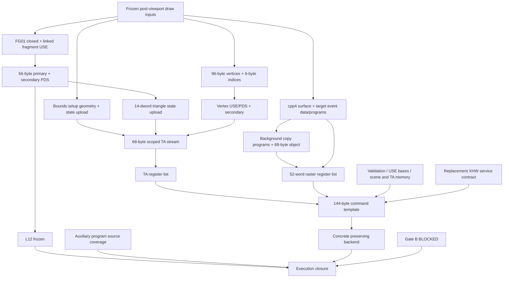

# Frozen triangle: independent static closure map

**Latest P7H-047–051:** [blocker burn-down](frozen-triangle-burn-down.md)
closes the scoped target layout and adds the concrete BO/wire model.
The earlier checkpoint matrices below are retained history. Current remaining
static groups are L12, FT-AUX, FT-BO publication and FT-SERVICE ready state.
The51 object interfaces,38 sites,68-byte TA stream and144-byte command persist.
Use `--bundle` for the joined specification; `--complete` continues to reject.


2026-09-27 — P7H-042–046. **PARTIAL specification, hardware-ready NO.**
L12 is **OPEN / EXTERNAL DEPENDENCY / frozen for this pass**. No PDS ISA,
provider-identity, count or corpus investigation was repeated. FG-01 remains
CLOSED; FG-02 OPEN; Gate B BLOCKED; whitelist `[]`; hardware UNVERIFIED.

This is the current dependency view, superseding obsolete open compiler-output
and generic pixel-key entries in the older [closure report](frozen-draw-closure.md).
It does not supersede historical UNKNOWNs. Route C defines a new CPU construction;
it has not proved auxiliary PDS input coverage or GPU contents preservation.

## Artifacts and interpretation

- [Object/dependency inventory](frozen-triangle-objects.csv): 51 nodes, including
  host interface objects, required kernel resources and TA fragment views.
- [Relocation ledger](frozen-triangle-relocations.csv): 38 **sites**, including
  seven TA-fragment sites repeated at their containing-stream offsets. These
  are not 38 kernel relocation records: each USE site expands into three records.
- [Blocker ledger](frozen-triangle-blockers.csv): independent remaining edges,
  execution gates separately, and the scoped FT-ORDER closure.
- [Serializer](../../../tools/psb-dri-re/frozen_triangle_image.py) produces JSON
  with a byte array per known-size payload and per-word provenance/formulas.
  `null` bytes mean **unresolved**, never a zero address. `bytes:null` means the
  object has not been serialized, not an empty object. `PARAM` identifies an
  established runtime input; `UNKNOWN` identifies a missing value/proof.
- [Tests](../../../tools/psb-dri-re/test_frozen_triangle_image.py) check geometry,
  state lengths/differences, target arithmetic, symbolic sites, submission counts
  and fail-closed behavior. They validate a CPU model, not GPU semantics.

READY in the inventory means **known CPU bytes/formulas for the stated inputs**.
It is not a claim of hardware validity. Dependencies carry their own blockers;
a READY instruction byte array can depend on an unproved launch contract.
The inventory is PARTIAL with respect to the complete execution path: unknown
service-owned state is explicitly represented rather than presumed absent.

## Exactly one selected configuration

The original [frozen inputs](frozen-draw-closure.md) remain in force. The new
surface-policy choices refine previously unspecified inputs; they are not
observations of the historical target.

| Property | Value | Classification / scope |
|---|---|---|
| API primitive / private primitive | triangles / code0 | FIXED_CONFIRMED CPU table, P7G-003 |
| Draw | indexed; indices0,1,2; three vertices | IMPLEMENTATION_POLICY already frozen |
| Vertex records | `(8,8,.5,1)`, `(24,8,.5,1)`, `(8,24,.5,1)` plus white RGBA | IMPLEMENTATION_POLICY post-viewport input |
| Layout | position4f then color4f; stride32; offsets0/16 | DERIVED_CONFIRMED, Mesa input mask2 |
| Vertex transform | software branch; HWTNL disabled | FIXED_CONFIRMED branch condition |
| Target | 32×32; cpp4; pitch32 pixels/128 bytes; 4096-byte payload | dimensions frozen; pitch/cpp IMPLEMENTATION_POLICY accepted by CPU formulas |
| Surface lifecycle | newly constructed surface, field+24=0, no pending clear | CONFIRMED constructor0x4b8e8; selected no-clear branch |
| Target byte channel order / device layout | not independently named by this pass | CONDITIONAL: cpp selector is known; FT-TARGET preserves architectural qualification |
| Target initial bytes | 4096 explicitly zero CPU bytes | IMPLEMENTATION_POLICY; backend/target proof pending, not historical fact |
| Viewport | post-viewport coordinates above; full32×32 bounds | policy; frontend orientation transform remains outside this backend input boundary |
| Fragment input | fixed-function primary-color MOV/END | FG-01 CLOSED |
| Compiler streams | main0, secondary0 instructions | CONFIRMED P7H-010/011 |
| Linked fragment USE | `00000000 f8040140` | CONFIRMED P7H-012 |
| Primary/secondary PDS | existing56-byte Route C image / `af000000` | CPU bytes known; L12 unchanged |
| Texture/fog/lighting/blend/logic/dither | disabled | frozen policy; no corresponding user shader resources |
| Depth/stencil/MSAA/cull/scissor/offset/queries/user clip | disabled; no depth attachment | frozen policy; does not eliminate internal bounds/background objects |
| Shading / color mask | smooth / all channels | frozen policy |
| Clear values | depth1.0, stencil0; **no GL clear call** | explicit policy; Mesa7.4.4 depth.c159/stencil.c584 corroborate defaults |
| Completion | finalize after this one user draw; normal TA, no feedback/OOM | scoped policy; exceptional recovery is not proved |
| Submission | historical CPU index0, 144-byte request, engine3 | serialization reference; no selected replacement backend yet |

The fragment **Mesa input mask2** at `fp+1c` is distinct from the compiled
result's zero primary-attribute count. `0x2daad` reads the former through
`C+670 -> +8`; it still chooses width8. Optimized empty compiler output does
not authorize dropping the color attribute. No vertex compiler work was redone.

## Dependency graph



The CSV dependencies are the machine-readable counterpart. CPU pointer keys
`0x128` and `0x150` are cache lookup inputs, not separate GPU objects. On the
selected compiler result (`+c0=0`, linked+70/+74=0, secondary fast path), their
texture/feature payloads are bypassed by `0x25970/0x39ea0`. Missing cache-key
identity bytes alone therefore are not a reason to block these already-derived
GPU images. No claim is made that every historical cache-key byte is zero.

## P7H-042: independent target/background output

All numeric addresses here are ELF VAs in the hash-pinned retained DRI. Ghidra
adds0x10000. The existing exports were read; newly needed small helpers were
checked with `llvm-objdump`, not executed.

`0x27060` always calls `0x392ab`, which emits target/event state. Even without
user textures, it also calls `0x39c5c` and `0x2f317` on the no-pending-clear path.
`0x4b8e8` explicitly initializes new surface+24 to0, so this is an existing
constructor branch, not an invented shortcut. Its internal texture-replace
program must remain in the object inventory.

For cpp4, helper `0x4b710:0x4b759–0x4b76d` returns the three CPU values
`0,0x0c000000,0`. With pitch32 and dimensions32, `0x392ab` emits target data:

```text
+00  000f8000
+04  symbolic color BO relocation (right2,left2,mask fffffffc)
+08  00000000
+0c  0001f01f
```

The relocation also requests placement flags`0x16000000` under mask`0xff000000`.
These are placement constraints, not bits silently ORed into the GPU address.

At `0x39308` cpp4 passes code0 to regparm helper`0x391e0`. The resulting16-byte
USE object is `84208180 fb200004 81200080 fb240044`. The distinct helper USE
created through`0x30422` is `00000000 f8348000` after finalization. The event PDS
commits`0x94` bytes with data count16. Its complete selected stores and three
relocation sites are in the serializer; +18,+1c,+3c remain producer-unwritten.
The known branch words at+48/+5c are `90000005/90000014`; no meanings are assigned.

The background USE emitter starts with constructor flag bytes04/08. Its one
copy slot plus finalizer gives `a0000000 28851001` (including repeat-field1 and
end bit). The 64-byte background PDS has seven producer data stores and four
literal instructions, plus its color/USE relocations. Its five holes at
+10,+14,+18,+1c,+2c are historically producer-unwritten. P7H-045 explicitly
initializes these CPU bytes under the new Route C policy; architectural consumed
state and GPU preservation remain unproved.

`0x2f317 -> 0x2ee34` commits68 bytes (reserves96); with primary data count12,
primary following field1, secondary count0 and depth value1 its first three
words are `R(background_secondary),00030001,R(background_pds)|0c000000`.
The remaining14 words are generated explicitly, including the three fixed
coordinate words`40004000,42004000,40004200`. This is a CPU layout, not a new
PDS launch or coordinate-semantic claim.

`0x2ab70` now has a complete **parameterized** 52-word no-depth raster list.
For32×32 its register0x410 value is`00020002`; no-depth0x480 is`000f0000`;
0xcb0/484/488/48c/490 values are zero;0x4bc is`00000200` with stencil-clear0;
0x4b8 is`3f800000` with clear-depth1;0xa60 is4 from event data count16.
Only background and event references are address-bearing here. None of these
register/value records was written to MMIO.

## P7H-043: state packing and scoped ordered TA stream

The initial34-word MTE template is cleared by`0x2b3d4`, present mask`5fc0`;
`+d3c=358637bd`. The selected ISP atom supplies low presence1 and first
word`01d00000`; width8 and smooth/no-cull state supply`08001800` and`00010000`.
HWTNL-zero skips`0x2be59`, preserving the six template zeros. The desired full
triangle state mask is consequently`5fc1`. Its pixel reference words reuse
P7H-038 unchanged. Q is not reinterpreted.

On the first full-bounds key `(0,0,32,0,32)`, scene's zeroed comparison cache
at+53c differs. `0x29251 -> 0x2a2f6 -> 0x29fbd` emits the setup geometry even
with scissor disabled. Only its first index draw runs. The first call at
`0x2a1c4–0x2a1d9` passes `P[0]==0` as true to`0x29f38`; state+0c therefore
receives`02000000`.

**Correction:** the older bounded report says ten words for mask`54c5` but lists
**eleven**. Explicit packing is mask +1+1+3+2+1+1+1 =11 dwords. This is44 bytes,
not40. The eleven values are:

```text
000054c5 07f00100 02000000 00000000 00000000 00000000
00000000 00000000 04001000 00010000 00000000
```

`0x28fff` caches all34 input words. Comparing the desired triangle state against
that cache removes groups80,1000,4000; mask`0f41` remains. Its14 words are:

```text
00000f41 01d00000 R(S) 00030000 R(P)|0c000000
00000000 00000000 00000000 00000000 00000000 00000000
00000000 08001800 358637bd
```

The terminator state is two words`00002000 00020002`. All three sizes fit a
single DMA part in`0x381a0`. Their state USE words are generated for n=11,14,2:
`a0000000,28a10001|((n-1)<<12),a0200000|(n<<7),fb274000`.
This scoped formula follows`0x287ff -> 0x30e22/0x30a09/0x30fb7`; it is not a
USE assembler. Associated60-byte PDS objects historically retain unwritten words; the new
CPU construction initializes those words explicitly under P7H-045.

The selected TA byte order is now bounded, subject to exactly the frozen API
and initial-cache inputs above:

| TA offset | Fragment | Bytes |
|---|---|---:|
|00|bounds state-program reference|8|
|08|setup six-index record, width4|20|
|1c|triangle state-program reference|8|
|24|user three-index record, width8|20|
|38|pretermination state-program reference|8|
|40|`c0000000`|4|

Total **68 bytes**. Program-reference words have backgrounds40000000,40000000,
60000000 respectively and second words0c02a203,0c02a204,0c02a201.
The TA register list remains the already-known56 bytes pointing to this stream.
The six fragments in the object table are **views** of this stream, not six
additional uploads. Their ledger rows are duplicated at container offsets for
review; a backend must emit only the container's seven relocation sites.

`0x27fa0` guards `0x29385` with global HWTNL!=0. That hardware-vertex constant
upload is excluded here. No query callback is active. The standalone vertex
secondary records are still allocated by the producer even though this TA
index packet references the primary descriptor. The historical index allocation
has capacity0x2000 entries; only three entries are read through this draw count.
No claim is made that its unused capacity was historically initialized.

This closes **FT-ORDER for the scoped CPU path**, not auxiliary program definedness,
shader semantics, BO-address validity, exceptional batching, or hardware execution.
It also does not change the prior primary first-use offsets160/1c0: those precede
this later bounds/state path. No first-use timeline was rebuilt.

## P7H-044: submission and resources outside the user uploads

The 144-byte normal-TA/no-feedback command now has a symbolic template. Pointers
and handles are marked parameters, high pointer halves are zero. TA flags3,
TA register count14, raster count52, engine3 and fence flags0 are fixed for this
caller. **OOM count0 does not imply zero OOM handle and offset:** `0x37b51`
aliases the raster descriptor when param7 is null, while setting only count0.
The tool preserves that behavior. Those handles are CPU ioctl metadata, not
GPU relocation sites.

The modeled31 non-alias sites expand to49 relocation records; this is a
covered-site count, not certification that the whole service submission needs
no further records. `0x28559 -> 0x26434` also allocates an8-byte suffix helper
before the secondary fast path. That helper is now included as a51st inventory
node although the selected GPU path has no reference to it.

Validation remains one136-byte wire record per **underlying BO**, not per image.
USE relocations at one dword expand to base selector op5(maskf), offset op4
(right15,left4,maskf0), offset op4(right4,left8,mask7ff00), preserving previous
masked results. Binding requires the candidate base-register/data-master
algorithm or a independently proved equivalent backend; symbolic U is not a
flat GPU address. See [existing BO/submission facts](frozen-draw-objects.md).

The already-qualified candidate source reveals resources omitted by a user-only
image list:

- `psb_scene.c:128–143`: scene hardware-data BO, size1420 from the closed32×32
  scene-info result, MMU/read/write/cached/SCENE flags. Page allocation rounds
  storage;1420 is the source's requested byte size, not proof of accessible bounds.
- `psb_scene.c:430–482`: **two** TA BOs of`pages*PAGE_SIZE`, one MMU (hw_data),
  one RASTGEOM (ta_memory), the latter aligned to1MiB. The source overwrites the
  service-reported size with`pages*PAGE_SIZE`; do not use620000 as both BO sizes.
- Candidate `psb_drv.c:42,268–269` defaults to32MiB TA size (8192 pages at4KiB),
  but permits a module parameter. The new backend has not selected its value.
- Retained Xpsb`0x3d70` rejects page count<=0x61f and reports620000 minimum;
  it fills cookie words2..12, leaving0/1 to the load stage.
- `psb_scene.c:249–267 -> psb_xhw_ta_mem_load -> Xpsb0x3df0` supplies the BO
  addresses and initializes cookie0/1 and10..12 before register consumption.
  This is TA/DPM state, not evidence about L12 or PDS launch reset.

The selected successful service chain includes scene-info(op1), TA-memory-info(op3),
TA-memory-load(op9), and **bind/fire(op2) for both TA and raster**. P7H-046 below
excludes scene-less raster-fire(op0) from this draw. Existing P7H-005/008
cover init/scene-info, not a complete replacement service. Known opaque cookie
fields cannot be replaced by zeros merely because this pass knows their size.
No extra SGX firmware requirement is invented: the old440-byte Xpsb BO's
necessity for this path remains UNKNOWN. MSVDX package work is not reopened.

## P7H-045: auxiliary CPU images made deterministic

The same Route C initialization policy is now applied **explicitly** to each
listed auxiliary PDS image. The output-buffer contract and stores establish
writable payload ranges: vertex reserves192/commits64 bytes; each state upload
reserves160/commits60; event reserves400/commits148; background reserves80/commits64.
Allocator bookkeeping is outside these payloads (P7H-025–028). A clean-room
serializer initializes each committed range before applying the exact recovered
stores and symbolic relocations. It does not change the start, size, or alignment,
and does not clear after instructions or relocations have been applied.

Every non-symbolic byte of these CPU images is now defined. Per-word
`historical_producer_unwritten=true` preserves historical provenance and
`origin=ROUTE_C_CPU_ZERO_POLICY` identifies the new initialization choice.
This is a CPU construction proof, **not evidence of historical clearing or of
architectural harmlessness/completeness**. No selected source is asserted to
read a hole, and no instruction is asserted to be confined to the committed
image. FT-AUX therefore remains open for source-state coverage, while missing
CPU hole bytes cease to be an independent serialization problem.

The 4096-byte color payload is also serialized as CPU zeros under explicit
implementation policy. This closes a missing initial CPU byte array; FT-TARGET
still governs the surface/layout contract and BACKEND its GPU visibility.
Relocation endpoints are included automatically in the dependency graph, in
addition to non-address dependencies.

## P7H-046: selected XHW requests and the remaining bootstrap boundary

The [service table](frozen-triangle-service.csv) records the two selected132-byte
request layouts as fields, not executable actions. Candidate `psb_sgx.c:1394–1398`
passes LASTPASS (TA flags3); `psb_scene.c:274–280` clears CLEARED before queuing.
Fresh scene flags are consequently0. `psb_set_scene_fire` adds SETUP4, and the
normal task has fire_flags1, no OOM, no copy-back, issue_irq0, irq_op0.
The TA request is op2, engine0, scene_flags4, scene_hw address as offset.
The hardware context is a reserved runtime context; assigning it is not a
fabricated GPU address or an inferred physical revision.

After successful TA completion, `psb_ta_done` adds DIRTY|COMPLETE3. The same
scene's retained hardware context causes `psb_set_scene_fire` to add SETUP_ONLY8
and SETUP4: raster request op2, engine1, scene_flags15, fire_flags1. This is
conditional on the explicitly frozen no-OOM/no-eviction successful path. The
scheduler submits the corresponding TA/raster register list **before** each
request. `psb_xhw_fire_raster`/op0 belongs to the scene-less path and is excluded.

Retained Xpsb `0x4550` on the TA branch reads cookie2..8, emits its bounded
setup sequence, and calls `0x4f10`. On the raster branch, helper`0x4030`
(regparm context/cookie, stack engine/offset/flags) sees flags15:
`(flags&9)!=1` skips the context reload; SETUP4 selects engine1; cookie14=0
skips OOM repair and **all cookie15 reads**. It writes reply rca2, and its
raster base formula is `GPU(scene_hw)+cookie7 = GPU(scene_hw)+0x1000`.
Cookie15 remains historically UNKNOWN; its exclusion here does not cover OOM.
The selected raster then calls`0x5040`. These are static consumer facts,
not permission to perform the historical register accesses.

The service uncertainty is now concentrated in the **target-compatible initial
register/context state and readiness of the recorded actions**. `0x4af0` reads
revision register+14 and derives `100+low_byte+10*second_byte`. Option+34 is1
for107/108, otherwise0; option+ac is1 for107/108/109, otherwise0. `0x3820`
therefore selects register+a74 value`0x05021900` versus`0x05188200`, and
context+0c/register+804 value`0x0100ffff` versus`0x0000ffff`. The actual target
revision has not been established, and these are not interchangeable policy
choices. The selected kick helpers use context+0c and explicit poll/ack
sequences (`0x4e10`); their hardware-ready preconditions and successful
completion have not been proved. That is FT-SERVICE's remaining edge. It is
separate from L12, provider identity, and dynamic request addresses. No new
register read, write, reset, kick, or service execution occurred.

## If L12 closed now

The tool's `--assume-l12-closed` changes only the displayed dependency filter.
It does not modify evidence, remove unknown bytes or authorize complete output.
Four independent static-contract groups still remain:

| ID | Precise unresolved edge | Narrow next evidence |
|---|---|---|
| FT-AUX | Auxiliary vertex, state-upload, event and background programs' complete consumed state is not bounded by their now-deterministic CPU images | A scoped consumed-state coverage contract for these enumerated programs; CPU holes now zero by policy, with no claim they are read |
| FT-TARGET | cpp4/pitch32 CPU packing is exact, but complete surface layout/channel and initialized-background contents contract has not been independently certified | Bind the recovered surface descriptor/placement to a legal new target construction; do not choose an unrelated default |
| FT-BO | Complete underlying-BO grouping, validation masks/placement and USE-base reservations are not instantiated for all51 nodes and service objects | Concrete BO/scene/TA allocation plan, using recovered formulas; includes page count and scene request input |
| FT-SERVICE | Selected service request fields are recovered; target-compatible bootstrap values and ready-state preconditions remain unproved | Revision-sensitive 0x4af0/0x3820 values and prerequisites of recorded poll/kick actions; op0 is not selected |

These are not claims that all remaining static source work is impossible or
exhausted. The pass has advanced each independent branch and exposed its current
boundary. FT-BO still needs a concrete allocation/validation plan; FT-SERVICE now reaches
the revision/bootstrap boundary rather than an unknown operation number;
**L12 is not the only remaining static blocker.** No missing random GPU address
is counted as an architectural unknown. Hardware testing is not required merely
to serialize these remaining CPU contracts.

## Required decision matrix

| Item | Status |
|---|---|
| FG-01 | CLOSED |
| L12 | OPEN / FROZEN |
| Primary PDS CPU image | READY, parameterized U |
| Secondary PDS | READY CPU word; semantics UNKNOWN |
| USE program | READY selected CPU words; launch contracts conditional |
| Vertex input | READY chosen post-viewport bytes |
| Fragment/pixel state | CONDITIONAL; CPU packing now specified |
| Render target | CONDITIONAL, FT-TARGET |
| Raster state | CONDITIONAL;52-word CPU list parameterized |
| Scene / TA / ISP | CONDITIONAL; scoped68-byte TA serialization known |
| Relocation ledger | PARTIAL whole path; complete sites for emitted object fragments |
| Buffer inventory | PARTIAL whole path;51 explicit known/required nodes |
| Command serialization | READY parameterized144-byte template |
| Kernel submission specification | CONDITIONAL, FT-BO/FT-SERVICE |
| Clean-room GPU backing preservation | CONDITIONAL |
| FG-02 | OPEN |
| Static frozen-triangle specification | PARTIAL |
| Hardware-ready | NO |
| Gate B | BLOCKED |

**Before static triangle:** L12 (frozen), FT-AUX, FT-TARGET, FT-BO, FT-SERVICE.
The scoped ordering/packing FT-ORDER is closed. Whole-execution source coverage
is different from having CPU command fragments.

**Before hardware execution:** all unresolved static contracts; a concrete
contents-preserving backend, address/binding/cache synchronization and lifetime
validation; existing Gate B ownership/recovery/revision requirements; reviewed
validation under a future authorized gate. Whitelist remains empty. Nothing in
this specification is an executable authorization.

## Reproduction and provenance

Retained DRI SHA256:
`74ca42991906741ee91be1bc088ae0b142fa71b6a85658c5dad0851ce50dd0d8`.
Retained Xpsb SHA256:
`da531587b1ec59fe433fa20ddd2e691b2f8b7fb35bb82525d4db99259c5e571f`.
No new source acquisition. Existing public kernel/Mesa sources retain their
recorded provenance; no quarantined material was opened. Decompiler exports
remain ephemeral under`/tmp/sgx535-psb-decompile` and`/tmp/sgx535-xpsb-decompile`.
[Targets](../../../tools/psb-dri-re/targets.txt) and
[extraction instructions](../../../tools/psb-dri-re/README.md) permit recovery.
For missing helper exports, inspect the exact ELF without executing it:

```sh
llvm-objdump -d --x86-asm-syntax=intel --start-address=0x391e0 --stop-address=0x39316 references/home:lkundrak:poulsbo/xpsb-glx/extracted/xpsb-glx/dri/psb_dri.so
llvm-objdump -d --x86-asm-syntax=intel --start-address=0x4b710 --stop-address=0x4b76f references/home:lkundrak:poulsbo/xpsb-glx/extracted/xpsb-glx/dri/psb_dri.so
python3 -B -m unittest discover -s tools/psb-dri-re -p 'test_*pds*.py' -v
python3 -B -m unittest discover -s tools/psb-dri-re -p test_frozen_triangle_image.py -v
python3 -B tools/psb-dri-re/frozen_triangle_image.py --json
python3 -B tools/psb-dri-re/frozen_triangle_image.py --assume-l12-closed
python3 -B tools/psb-dri-re/frozen_triangle_image.py --complete
```

The last command must fail. `--write-tables` regenerates only this pass's three
CSVs plus the service-request CSV; it does not regenerate prior maps. Tests do not prove architecture by
assertion: unknown consumed-state coverage, unresolved resource bindings and conditional
backing remain blockers even when every host test passes.

## Validation checkpoint

All42 pre-existing PDS-related tests and24 new frozen-triangle tests pass.
Negative cases cover missing objects/relocations/provenance, wrong alignment,
known-word corruption, incompatible overlap, an invalid scene-less service
request, omitted initialization, UNKNOWN complete output and false status
promotion. Both complete-image mode and the launch checker's require-closed
mode reject as required. The test suite is a host-model check, not a hardware
validation result.

The two retained ELF hashes and all eight pinned existing public-source hashes
were reverified. Changed CSV headers/row widths, local Markdown file links and
new evidence IDs P7H-042–046 were checked, without rejecting pre-existing
multi-row IDs. Python compilation and `git diff --check` pass. The index is
empty and references/ has no Git changes. No proprietary executable or device
interface was invoked. Existing uncommitted work remains preserved.

Latest P7H-052–054 result: see [the final closure attempt](frozen-triangle-burn-down.md). The existing51-object/49-wire-record model is preserved. B2 stays closed; publication, bootstrap readiness and primary/auxiliary source domains remain unresolved. The bundle includes the shared closure ledger.
