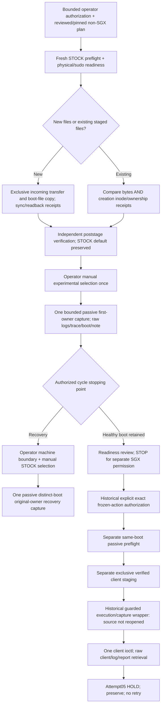

# PRE07: historical live authority, composition and current applicability

Offline historical/procedural investigation, 2026-10-04. No hardware contact,
boot, staging, SGX, restricted-source reconstruction, qualification or test rerun.
The response-export approval, Gate B, whitelist,70/70 first-owner record and
current PRE07 matrix remain unchanged. CONFIRMED means a cited record/source;
INFERRED means supported linkage; UNKNOWN means not established.

## What made historical operations legitimate

The original [first-load procedure](first-load-staging-boot-recovery-procedure.md#0-scope-identity-and-authorization)
explicitly distinguishes offline design PASS from live authorization. It requires
bounded operator authorization naming staging, manual selection, passive observation
and operator-boundary STOCK recovery. Its first-load scope excludes client execution.
[Cycle02 SCOPE](../hardware-evidence/MINI12-20261001T062604Z-FIRSTLOAD-CYCLE-02/SCOPE.md),
[STAGING-SCOPE](../hardware-evidence/MINI12-20261001T062604Z-FIRSTLOAD-CYCLE-02/STAGING-SCOPE.md)
and [OBSERVATION-SCOPE](../hardware-evidence/MINI12-20261001T062604Z-FIRSTLOAD-CYCLE-02/OBSERVATION-SCOPE.md)
record the authority and reviewed program before contact. Scope documents record
operator authorization; they are not independent cryptographic attestations.

The controller supplies source, scope, provenance and authorization to
[capture_once](../../tools/psb-dri-re/frozen_first_load_capture_v2.py#L121).
That API performs one pinned connection after explicit readiness, creates an exclusive
LOCAL evidence directory before connecting, saves root/wrapper source identities,
stdout/stderr/exit/timing and partial timeout output, and never retries. It does not
supply a target root program or grant authority. Target sudo-n runs the passive
program with credential-free stdin; actual root results corroborate local sudo-v reports.

Historical rebinding was real and explicit. [Cycle05 provenance](../hardware-evidence/MINI12-20261002T001828Z-FIRSTLOAD-CYCLE-05/future-capture-source-provenance.json)
records only the prior STOCK UUID replacement in the experimental reference source.
[Cycle06 provenance](../hardware-evidence/MINI12-20261002T005013Z-FIRSTLOAD-CYCLE-06/future-capture-source-provenance.json)
does the same under its new [authorization](../hardware-evidence/MINI12-20261002T005013Z-FIRSTLOAD-CYCLE-06/AUTHORIZATION.md).
The available capture-stage.py controllers check source/tooling pins, readiness,
preflight and staged creation receipts before calling the passive API. A failed sudo
capture stays failed; [a literal separate authorization](../hardware-evidence/MINI12-20261002T005013Z-FIRSTLOAD-CYCLE-06/operator-preflight-02-readiness.json)
permitted one fresh preflight after authentication. This was not an automatic retry.

## Actual historical procedure graph

This graph describes completed historical branches. It is NOT an executable current
procedure. Cycle05 and diagnostic cycles exercised recovery; Cycle06 retained its
healthy experimental boot. The corrected first-load/Attempt05 chain was separate.
No new reset, boot or SGX permission follows from the graph.

## Operation/evidence ledger

The [nine-operation detailed matrix](/home/gama/sgx535-offline/phase8-historical-pre07-20261004T104700Z/historical-operation-matrix.json)
records, separately, action, caller/component, authority, identities, destinations,
protection, guards and relative timing, streams/kernel evidence/association,
continuity, privilege/recovery, STOP conditions, source availability and current
applicability. UNKNOWN is retained for restricted implementation details and absent
standalone authority/controller records.

| Historical operation | Authority and actual evidence | What it established |
| --- | --- | --- |
| Cycle02 staging | SCOPE/STAGING-SCOPE; staging-writer.py and staging/decoded-records.json | STOCK49 preflight; same-boot guarded exclusive image/config creation; opened-directory/no-follow protection, root0644/single-link, file+parent sync, reopened readback and dev/ino receipts. |
| Cycle05 first-owner attempt/recovery | AUTHORIZATION.md, READ-ONLY-SCOPE.md, capture-stage.py, RESULT.md | STOCK54; experimental23 then health STOP; no hook/end receipt recovered. Manual STOCK recovery55 and three actual distinct boot IDs; failed capture not rewritten. |
| Cycle06 first-owner | AUTHORIZATION.md and RESULT.md | New bounded scope;54/55 guards; exact note/ordered trace; uptime130.27–137.27; sudo failure and separately authorized fresh preflight both preserved. Gate B readiness did not authorize staging or SGX. |
| Corrected first-load/Attempt05 | Corrected authorization-and-scope.json; proposed-first-sgx-action.json; Attempt05 RESULT.md | Boot203a5b9b, module2eaffd..., image55e7a8..., old client758076...;25 fresh guards, separate root client stage, then one guarded call. HOLD/zero events/no readback; no retry. |
| Diagnostic staging | DIAGNOSTIC-STAGING-01 scope.json/RESULT.md | STOCK d78d...;36 preflight/18 readiness/38 poststage; exclusive isolated image/backup/pending config, then atomic publication retaining old prefix and STOCK default. |
| Diagnostic first-owner/recovery | Same RESULT and capture plans | Diagnostic698478...66 guards, then manual STOCK bce184...39 root guards. Raw wrapper schema STOP retained; offline alias adjudication was not a second capture. |
| Diagnostic first-owner02 | DIAGNOSTIC-FIRSTOWNER-02 scope.json/RESULT.md | Boot55bb..., old diagnostic Build ID594030...;66 passive guards. Subsequent reported restriction stopped client staging/execution review. Rejection reason UNKNOWN. |
| Current candidate first-owner | frozen staging preparation.json; prospective operator-decision/review; actual command/decoded records | STOCK149fd...49; stage repeated48; poststage42; later STOCK f684...33 refresh; candidate89fc...70. Candidate note/hook/Live observed; zero SGX. Manual observation revision changed photography only. |

## Protected destinations: what was actually done

Paths were selected in reviewed fixed plans/programs, not inferred from successful
copy commands. The Cycle02 image/incoming/custom.cfg paths were absent before
creation; trusted parents, UID/GID/mode/type/link/space were checked. The copy
primitive [copy_exclusive](../../tools/psb-dri-re/frozen_first_load_stage.py#L21)
accepts a verified parent descriptor and fixed payload identity, emits creation/failure
receipts, checks file+parent sync and reopened content/inode. Later cycles reused
existing files only after comparing their creation dev/ino as well as bytes.

Diagnostic/current-candidate staging prospectively chose unique image/incoming/backup
and pending names. It preserved old entries, verified the new image before publishing
configuration, then atomically replaced only the reviewed configuration with its
old exact prefix retained. [Current stage receipts](../hardware-evidence/MINI12-20261003T002627Z-FROZEN-FIRSTOWNER-314e2f3b-01/stage/stdout.txt)
record root0644/single-link files, actual sync/readback and publication phases.
The incoming directory receipt records UID1000/mode0700. The poststage capture checked
saved STOCK/default and exact staged bytes; the later33-guard refresh reused image
identity and checked its inode/metadata plus small configuration/default instead of
rehashing the image again.

Attempt05's permitted summary identifies the exclusive root0700/single-link old client
at `/root/sgx535-frozen-seq1-203a5b9b/frozen-triangle-one-shot-i386` and absent `color.bin`.
It does not expose exact parent/stream creation or sync implementation. These are
UNKNOWN without the restricted wrapper. That old path is historical evidence, not a
current proposed destination. The new approved client requires a distinct raw response
argument in addition to image output; historical old-client staging/call records do
not bind that new role or the current archive transaction.

## Fresh guards and attribution: demonstrated scope

The available profiles read uname/proc/sysfs/module note/PCI/DRM node metadata,
framebuffer/VT/IRQ/services, complete dmesg/health, file/config/default identities and
boot IDs. First-owner profiles additionally read the volatile ordered hook trace.
The wrapper emits unprivileged identity before sudo and same-boot end/uptime after;
host monotonic duration, target uptime and operator boot-watch are separate clocks.
The experimental/recovery profile has a1200-second kernel-clock ceiling and40/35
connection/child bounds. Current collector clock expiry is INFERRED if continuous
normal boot is preserved; no present uptime was observed. The first-owner ceiling
cannot simply be removed or replaced by stock_preparation to obtain fresh SGX guards.

The current candidate passive root program is physically available and already matches
this module/image, but its role is first-owner qualification: prior STOCK UUID,
selected image/trace, boot-age bounds and completed capture. It does not establish
current approved client/evidence paths or complete unused-invocation history. The
[generator](../../tools/psb-dri-re/frozen_candidate_stage.py#L299) exposes STOCK preflight,
poststage, first-owner and STOCK recovery profiles, not a current diagnostic
pre-invocation guard profile. STOCK sources would require the original loaded module;
recovery requires a new distinct boot. Neither is the present diagnostic guard.

Historical first-owner association used image/stage receipts, manual selection,
new boot identity, exact loaded note, ordered hook, raw kernel log, current ownership
and bounded capture clocks. It establishes first load, not a GPU invocation.
Attempt05 associated the one client's result with verified boot/note/ownership/hash,
before/result records and preserved streams/retrieval. Kernel logs before/after were
byte-identical. The accepted conclusion remained TA fire UNKNOWN/POSSIBLE, completion
unobserved and no triangle. That association was sufficient for the conservative
failed-attempt record; it did NOT demonstrate successful completion attribution.
No successful historical capture here proves that the same wrapper meets current
successful4268-byte/original-image/accepted-TA/end-render/3D-free requirements.
No new correlation token or scheme is proposed by this investigation.

## Current applicability and direct PRE07 mapping

| Historical component | Classification | Current PRE07 responsibilities / exact reason |
| --- | --- | --- |
| Pinned transport and generic exclusive-copy interface | AVAILABLE + APPLICABLE | Reusable technical interfaces, rows8/9/10/11/12/19; supply no source/path/live-operation authority or freshness. |
| Cycle05/06 controllers and root bindings | AVAILABLE BUT STALE-BINDING | Old evidence dirs, prior UUID, old module/image/config, pinned tooling and consumed cycle scope; rows1/14/15/17/18/20. |
| STOCK pre/post/recovery sources | AVAILABLE BUT STALE-BINDING | STOCK original-note/default/absence/distinct-boot predicates; cannot be relabeled current diagnostic guards; rows14/15/18/19. |
| Current candidate first-owner root/capture API | AVAILABLE BUT INSUFFICIENT | Correct module/image but completed first-owner role/clock; no new-client destinations/history or invocation boundary; rows1/3–7/14–21. |
| Standalone current protected client/evidence preparation | AVAILABLE BUT MISSING CURRENT AUTHORITY | File algorithms available; exact reviewed parent/path/profile and live-operation scope unestablished; rows3–5/9–12/19–21. |
| Exact historical invocation/preservation wrapper | UNAVAILABLE/RESTRICTED | Files may remain physically present; permitted summary only inspected. Review/reconstruction prohibition remains; rows6/7 and surrounding live orchestration. Old boot/client/action authorization is also consumed. |
| Offline archive/checker | AVAILABLE + APPLICABLE | Rows8/10/11/12/13/22 within supplied-file scope; does not authenticate runtime producer/events or collect live guards. |
| Historical operator readiness/recovery observations | AVAILABLE BUT STALE-BINDING | Reusable recovery model/precedent, not current privilege, display/control readiness or history; rows16–18. |

## Do the three gaps collapse?

CONFIRMED: the historical SGX workflow combined several separately executed stages:
same-boot passive preflight, exclusive client stage and guarded execution/capture.
The execution wrapper itself rechecked identity/health immediately before the client;
file staging and passive captures were separate programs. The host coordinated them.

A single missing authority signature is therefore NOT established as the whole gap.
Three requirements remain unmet. There are **two demonstrated dependency families**:
(1) available passive/file-preparation capabilities needing an applicable current
role/source/path binding and scope; (2) restricted exact invocation/preservation/
correlation implementation. The precise source-level coupling within the restricted
wrapper is UNKNOWN. The evidence does not prove either one available rebindable
orchestrator or three independently unavailable mechanisms. Prior statements about
independent requirements do not establish three independent missing implementations.

Non-SGX rebinding is supported by historical precedent, but today's missing profile
and path plan require concrete scope/review; that is not merely changing a UUID/hash.
The [bounded pending review request](pre07-available-preparation-binding-review-request-20261004.json)
identifies only available passive/preparation components and missing review inputs.
It is not an implemented procedure, additional readiness gate or approval. An
execution-ready maintainer decision is not prepared because its current source/profile
and destinations do not exist. No request to replace/reopen restricted machinery is made.

Full historical one-shot rebinding: **NO under present boundaries**. New maintainer
Gate B/client approvals expressly preserve restrictions and grant no live preparation
or execution permission. The later restriction is recorded in diagnostic first-owner02
RESULT and the authoritative handoff; its platform rejection reason is UNKNOWN.
Source presence does not erase that boundary. Historical permission is not reusable
on a new boot/module/client or after its one invocation was consumed. The new client's
raw-output interface also requires an actual reviewed transaction change, not a blind
old-wrapper repin. No new kernel mechanism is demonstrated necessary.

Protected live destinations: not established. Fresh guards: no applicable current
collection route established. Staging: not permitted. PRE07 BLOCKED; READY FOR
EXECUTION AUTHORIZATION:NO. Counts remain5 satisfied/15partial/2unavailable.
The single irreducible boundary remains lawful availability/review of the exact
invocation-scoped preservation/correlation transaction; a current passive/path
binding alone cannot supply or authorize it.

## Preservation and checks

Detailed evidence, inspected-path inventory, authority snapshots, Git status and
record consistency checks are in:
`/home/gama/sgx535-offline/phase8-historical-pre07-20261004T104700Z/`.
No test/build/qualification was repeated. A metadata parser initially expected `name`
where candidate guards use `guard`; the extraction was corrected without changing raw
records, source or classification. Authority/handoff/matrix bytes remain unchanged.
No stage/commit; dirty/untracked work retained. sgx_execution_authorized=false;
SGX invocations0; hardware interactions0; triangle NOT ATTEMPTED; no new HOLD/recovery.
