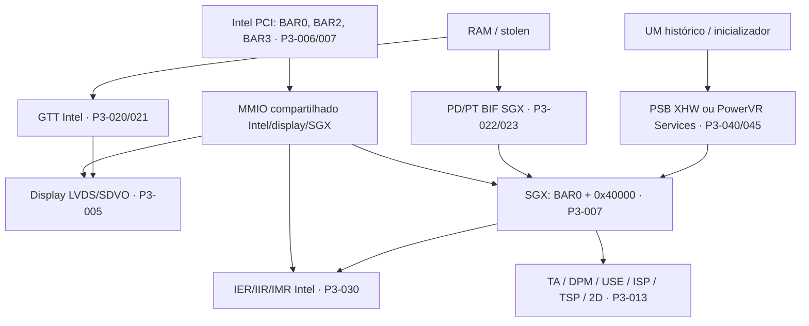

# Integração Poulsbo: arquitetura e fronteiras

Fase 3 — análise estática, 2026-09-17. `CONFIRMED` significa o que a fonte declara/implementa; `INFERRED` é interpretação; `UNKNOWN` é lacuna. IDs P3 remetem à [matriz](evidence-matrix.csv), com repositório, commit, arquivo e linhas. Os snapshots preservam a numeração original; ver [proveniência](poulsbo-data/sources.json). Nenhum procedimento abaixo foi executado na GPU.

**CONFIRMED [P3-001]** — O Linux associa os IDs PCI 8086:8108 e 8086:8109 a psb_chip_ops e descreve Poulsbo/GMA500/Atom Z5xx como PowerVR SGX535. Fontes: [LDRVC:43-59](poulsbo-data/../archaeology-data/LDRVC.txt).

**CONFIRMED [P3-002]** — O alvo pc_i686_poulsbo_d0_linux do DDK 1.14 seleciona por padrão SGX535, SGX_CORE_REV=121 e dc_poulsbo; isso é configuração de build, não identificação da placa disponível. Fontes: [PBUILD:42-74](poulsbo-data/../archaeology-data/PBUILD.txt); [VER14:45-62](poulsbo-data/../archaeology-data/VER14.txt).

**CONFIRMED [P3-003]** — O ramo SGX535 declara VA de 32 bits, 16 directory lists, hardware 2D e duas USE pipes. Não usar as features dos ramos SGX540/544 para completar esse conjunto. Fontes: [FEATURE:76-88](poulsbo-data/../archaeology-data/FEATURE.txt).

**CONFIRMED [P3-004]** — O gma500 atual declara MODESET e GEM, dumb_create e uma tabela vazia de ioctls próprios. Esse driver não expõe aqui uma interface de submissão 3D SGX. Fontes: [LDRVC:91-95](poulsbo-data/../archaeology-data/LDRVC.txt); [LDRVC:499-516](poulsbo-data/../archaeology-data/LDRVC.txt).

**CONFIRMED [P3-005]** — A configuração de saídas Poulsbo chama LVDS e SDVO; psb_chip_ops usa o offset SGX específico PSB_SGX_OFFSET. Fontes: [DEVICE:18-25](poulsbo-data/DEVICE.txt); [DEVICE:265-293](poulsbo-data/DEVICE.txt).

## Mapa reconstruído

**INFERRED:** o mapa reúne relações de software e recursos; não é um diagrama elétrico nem prova de que SGX passa pela GTT. O pin de um objeto mantém duas traduções (P3-022).

| Fronteira | Evidência | O que não concluir |
|---|---|---|
| A — Intel/Poulsbo | PCI, BARs, GTT, stolen, IRQ agregado, PM PCI (P3-006/020/021/030/035) | OMAP usa a mesma integração |
| B — núcleo SGX535 | BIF, PD/PT, eventos, reset, USE/PDS (P3-003/013–019/023) | Todos os registradores e efeitos laterais conhecidos |
| C — display | LVDS/SDVO, scanout, vblank (P3-005/030) | Vblank é fence 3D |
| D — gma500 atual | KMS/GEM, GTT e parte SGX/MMU/reset/fault (P3-004/022/024/031/034) | A presença de BIF é aceleração 3D disponível |
| E — históricos | CMDBUF/relocations/XHW; Services/init/CCB/microkernel (P3-040–054) | PSB e EMGD têm a mesma ABI ou devem ser reutilizados |

## Escopo e fontes

O trabalho usa os três repositórios locais e snapshots textuais adicionais de [gregkh/psb-kmp](https://github.com/gregkh/psb-kmp/tree/98b5307e5158a9ac401b29128ddd1184ae06b4d7) e [EMGD-Community/intel-binaries-linux](https://github.com/EMGD-Community/intel-binaries-linux/tree/e6884ec2eaaf1afe88d5ff9dd44d70403525be5b). O segundo é um espelho comunitário: seus arquivos são evidência da implementação publicada ali, não documentação oficial de hardware nem prova de autenticidade de cada release Intel. Commits completos, hashes SHA-256 e paths estão no catálogo.

A varredura adicional dos blobs históricos TI por EMGD, US15W/WP/WPT, Atom Z5xx, Poulsbo e dependências PSB está em [extended-history-matches.json](poulsbo-data/extended-history-matches.json). Complementa a varredura de todas as refs da fase 2; não representa busca exaustiva de todos os arquivos da Internet. O Linux local continua com histórico raso; não atribuir a ele a história do PSB externo.

**UNKNOWN:** correspondência exata entre 8108/8109, US15W/US15WP/US15WPT, stepping físico e revisões SGX121/126. O sufixo d0 do nome de build não resolve essa correspondência.

O documento oficial [Intel EMGD 1.14, 324002-007US, p.1](https://www.intel.com/content/dam/www/public/us/en/documents/technology-briefs/emgd-v1-14-feature-matrix.pdf) declara validação para Atom Z5xx com US15W, US15WP e US15WPT (P3-060). Isso comprova o escopo comercial declarado, não identidade de MMIO, clocks ou errata entre variantes.

A conclusão e os bloqueadores estão em [bring-up](poulsbo-bringup-requirements.md).
