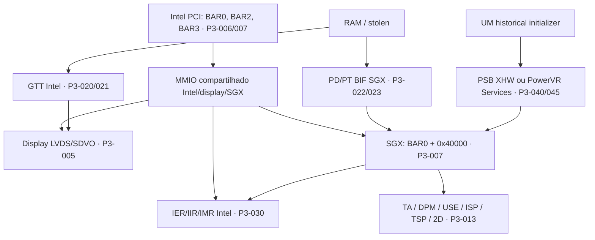

# Poulsbo Integration: architecture and borders

Phase 3 — static analysis, 2026-09-17. `CONFIRMED` means the source declares/implements; `INFERRED` is interpretation; `UNKNOWN` is gap. P3 IDs refer to [matrix](evidence-matrix.csv), with repository, commit, file, and lines. The snapshots preserve the original numbering; see [provenance](poulsbo-data/sources.json). No procedure below was executed on the GPU.

**CONFIRMED [P3-001]** — Linux associates PCI IDs 8086:8108 and 8086:8109 with psb_chip_ops and describes Poulsbo/GMA500/Atom Z5xx as PowerVR SGX535. Sources: [LDRVC:43-59](poulsbo-data/../archaeology-data/LDRVC.txt).

**CONFIRMED [P3-002]** — The target pc_i686_poulsbo_d0_linux of DDK 1.14 defaults to SGX535, SGX_CORE_REV=121, and dc_poulsbo; this is build configuration, not identification of the available board. Sources: [PBUILD:42-74](poulsbo-data/../archaeology-data/PBUILD.txt); [VER14:45-62](poulsbo-data/../archaeology-data/VER14.txt).

**CONFIRMED [P3-003]** — The SGX535 branch declares a 32-bit VA, 16 directory lists, 2D hardware, and two USE pipes. Do not use the features of the SGX540/544 branches to complete this set. Sources: [FEATURE:76-88](poulsbo-data/../archaeology-data/FEATURE.txt).

**CONFIRMED [P3-004]** — The current gma500 declares MODESET and GEM, dumb_create, and an empty table of its own ioctls. This driver does not expose a 3D SGX submission interface here. Sources: [LDRVC:91-95](poulsbo-data/../archaeology-data/LDRVC.txt); [LDRVC:499-516](poulsbo-data/../archaeology-data/LDRVC.txt).

**CONFIRMED [P3-005]** — The Poulsbo output configuration calls LVDS and SDVO; psb_chip_ops uses the specific SGX offset PSB_SGX_OFFSET. Sources: [DEVICE:18-25](poulsbo-data/DEVICE.txt); [DEVICE:265-293](poulsbo-data/DEVICE.txt).

## Reconstructed map

**INFERRED:** the map gathers software and resource relationships; it is not an electrical diagram nor proof that SGX goes through GTT. An object's pin maintains two translations (P3-022).

| Border | Evidence | What not to conclude |
|---|---|---|
| A — Intel/Poulsbo | PCI, BARs, GTT, stolen, aggregated IRQ, PCI PM (P3-006/020/021/030/035) | OMAP uses the same integration |
| B — SGX535 core | BIF, PD/PT, events, reset, USE/PDS (P3-003/013–019/023) | All known registers and side effects |
| C — display | LVDS/SDVO, scanout, vblank (P3-005/030) | Vblank is 3D fence |
| D — gma500 current | KMS/GEM, GTT and part SGX/MMU/reset/fault (P3-004/022/024/031/034) | The presence of BIF is 3D acceleration available |
| E — historical | CMDBUF/relocations/XHW; Services/init/CCB/microkernel (P3-040–054) | PSB and EMGD have the same ABI or should be reused |

## Scope and sources

The work uses the three local repositories and additional textual snapshots of [gregkh/psb-kmp](https://github.com/gregkh/psb-kmp/tree/98b5307e5158a9ac401b29128ddd1184ae06b4d7) and [EMGD-Community/intel-binaries-linux](https://github.com/EMGD-Community/intel-binaries-linux/tree/e6884ec2eaaf1afe88d5ff9dd44d70403525be5b). The second is a community mirror: its files are evidence of the implementation published there, not official hardware documentation nor proof of authenticity of each Intel release. Complete commits, SHA-256 hashes, and paths are in the catalog.

The additional scanning of historical TI blobs by EMGD, US15W/WP/WPT, Atom Z5xx, Poulsbo, and PSB dependencies is in [extended-history-matches.json](poulsbo-data/extended-history-matches.json). It complements the scanning of all refs from phase 2; it does not represent an exhaustive search of all Internet files. The local Linux still has shallow history; do not assign it the history of the external PSB.

**UNKNOWN:** exact correspondence between 8108/8109, US15W/US15WP/US15WPT, physical stepping and SGX121/126 revisions. The d0 suffix in the build name does not resolve this correspondence.

The official document [Intel EMGD 1.14, 324002-007US, p.1](https://www.intel.com/content/dam/www/public/us/en/documents/technology-briefs/emgd-v1-14-feature-matrix.pdf) declares validation for Atom Z5xx with US15W, US15WP, and US15WPT (P3-060). This proves the declared commercial scope, not the identity of MMIO, clocks, or errata between variants.

The conclusion and the blockers are in [bring-up](poulsbo-bringup-requirements.md).
